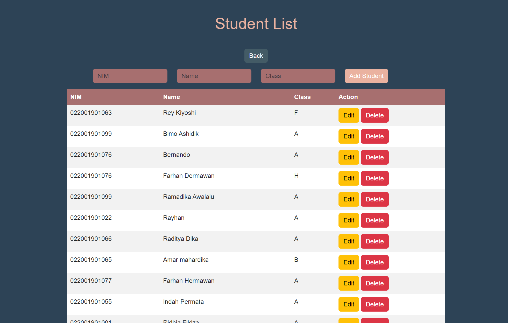

# Student Management App

This application is a simple and efficient solution for managing a list of students. It includes both frontend and backend components that allow users to view, add, edit, and delete student entries.

## About the Application
This application is a student management tool designed to assist educational institutions or organizations in tracking student data. The application encompasses four main functions: viewing a list of students, adding new students, editing existing student data, and deleting students.

## Features
- **View Student List:** Display a complete list of students with NIM (student ID), full name, and class details.
- **Add New Students:** Add new students with NIM, name, and class details.
- **Edit Student Data:** Modify existing student data, including NIM, name, and class.
- **Delete Students:** Remove student entries from the list.

## Getting Started
### Prerequisites
Before getting started, make sure you have met the following requirements:

- Node.js is installed on your computer.
- PostgreSQL database is configured and running. Update the database configuration in `backend knexfile.js` if necessary.
  you can see my knexfile.js for see my data base and you can change
- if you "change" data base don't forget to running migrations and seed

## How to Run Migration and Seed
  1. first running migration: npx knex migrate:latest
  2. second running Seed : npx knex seed:run

## Instalation 
Terminal Bash:
   1. git clone https://github.com/FarhanHermawan/Gold-Project.git
   2. cd Gold-Project
   3. cd backend
   4. npm install

## Usage
  1. cd backend
  2. npm start
The server will run on http://localhost:3000.
Open your browser and access the frontend at http://localhost:3000.
You can click "Get Start" for see student data's

## API Endpoints
The following API endpoints are available:\
  1. GET /api/v1/students: Get a list of all students.
  2. GET /api/v1/students/:id: Get a student by ID.
  3. POST /api/v1/students: Create a new student.
  4. PUT /api/v1/students/:id: Update a student by ID.
  5. DELETE /api/v1/students/:id: Delete a student by ID.
You can use these endpoints to interact with the student data.

## Postman Documenter
https://documenter.getpostman.com/view/28440197/2s9Y5ctfo8